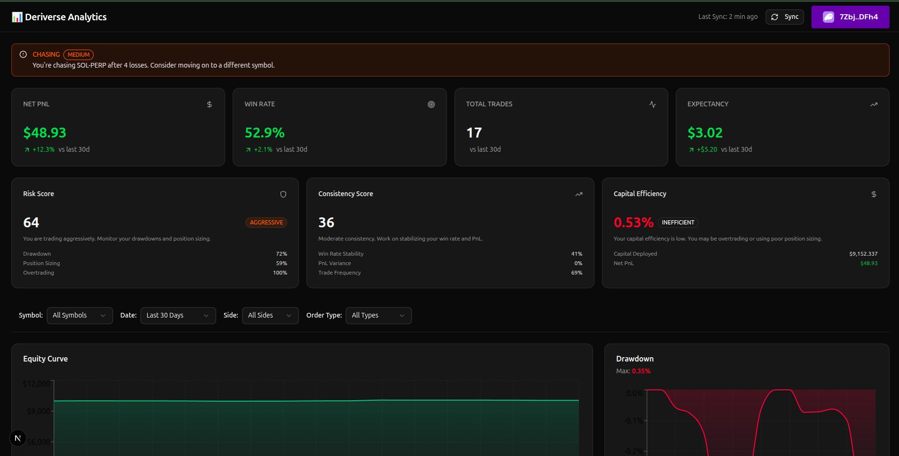

# 📊 Deriverse Analytics

[](https://opensource.org/licenses/MIT)
[](https://nextjs.org)
[]()

> Institutional-grade trading analytics for Deriverse, without the indexer.



## 🚨 The Problem

Retail traders on DEXs operate in the dark. They lack the self-awareness tools that institutional traders take for granted. Existing dashboards show *what* happened (PnL), but not *why* (Behavior).

Most traders lose money because of psychology, not strategy.

## 💡 The Solution

**Deriverse Analytics** is a behavioral coaching layer for traders. We don't just track your PnL; we analyze *how* you trade to identify patterns like revenge trading, over-leveraging, and inconsistency.

### Key Features (The "Wow" Factor)

- 🎲 **Trader Risk Score (0-100):** A dynamic score analyzing your drawdown, position sizing, and volatility. Are you "Balanced" or "Reckless"?
- 🔥 **Overtrading Detection:** Real-time alerts for dangerous patterns like "Revenge Trading" (3+ losses in 30 mins) or "Fatigue" (declining win rate over 10+ trades).
- 📊 **Consistency Score:** We reward steady, reproducible performance over lucky home runs.
- 💰 **Capital Efficiency:** An institutional-grade metric tracking how well you utilize your deployed capital.
- 🔒 **Privacy-First:** 100% client-side aggregation. No central database of your trades unless you sync.

---

## 🛠️ Technical Architecture

We prioritized **speed, privacy, and decentralization** over historical depth. This architecture requires **NO Indexer**, making it lightweight and easy to deploy.

- **Frontend:** Next.js 14, Recharts, Tailwind CSS, shadcn/ui
- **Backend:** Next.js API Routes (Serverless), PostgreSQL (via Drizzle ORM)
- **Blockchain:** Solana Web3.js, SIWS (Sign In With Solana)
- **Data Pipeline:** Direct RPC fetching + Optimistic UI updates

### Why No Indexer?

| Feature | Indexer Approach | Our Approach (RPC + DB) | Why Ours Wins |
| :--- | :--- | :--- | :--- |
| **Data Freshness** | Laggy (wait for sync) | **Real-time** (Direct RPC) | Traders need instant feedback. |
| **Cost** | High ($$ infrastructure) | **Low/Free** (Standard RPCs) | Sustainable for open-source. |
| **Privacy** | Centralized DB required | **User-owned** (Sync on demand) | Data only exists when you connect. |

---

## 🚀 Getting Started

### Prerequisites

- Node.js 18+
- PostgreSQL (Local or Cloud)
- Solana Wallet (Phantom/Solflare)

### Installation

1. **Clone the repo**
   ```bash
   git clone https://github.com/your-username/deriverse-analytics.git
   cd deriverse-analytics
   ```

2. **Setup Environment**
   ```bash
   cp .env.example .env.local
   # Fill in DATABASE_URL and JWT_SECRET
   ```

3. **Install Dependencies**
   ```bash
   npm install
   ```

4. **Run Migrations**
   ```bash
   npx drizzle-kit push
   ```

5. **Start Dev Server**
   ```bash
   npm run dev
   ```

Open [http://localhost:3000](http://localhost:3000) to see the app.

---

## 📸 Screenshots

### Risk Score & Advanced Metrics
*(Add screenshot of Advanced Metrics component)*

### Overtrading Alerts
*(Add screenshot of Alert banner)*

### Interactive Equity Curve
*(Add screenshot of Main Chart)*

---

## 🤝 Contributing

Contributions are welcome! Please feel free to submit a Pull Request.

## 📄 License

This project is licensed under the MIT License - see the [LICENSE](LICENSE) file for details.
